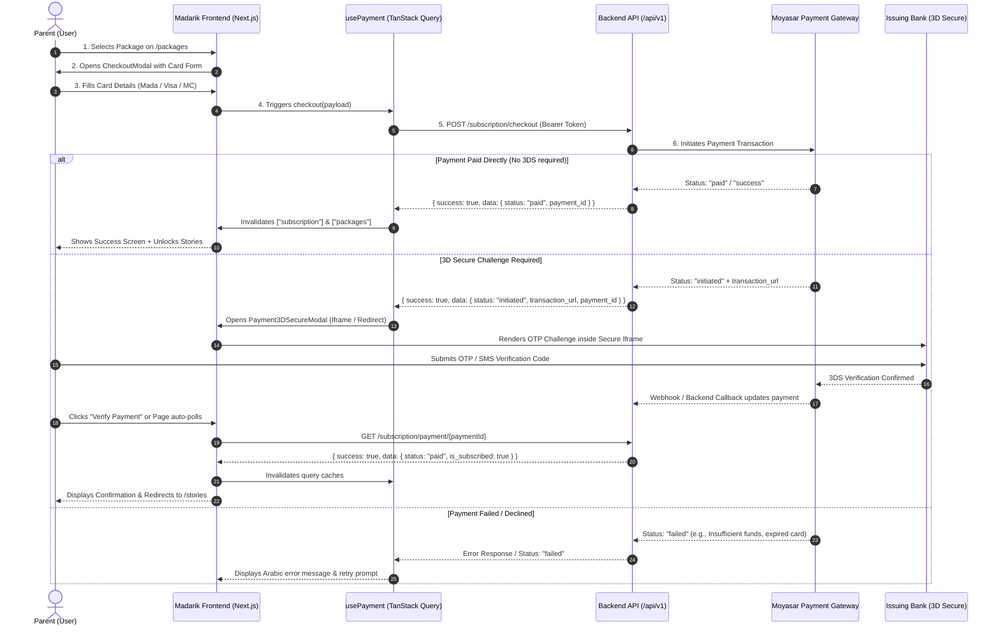

# Payment Architecture & Integration Flow — Madarik

This document provides a comprehensive technical overview of the **Payment System**, **Subscription Lifecycle**, **Payment Gateway Integration (Moyasar)**, and **API Endpoints** implemented in the **Madarik (مدارك القراءة)** platform.

---

## 1. Executive Summary & Tech Stack

The Madarik payment architecture enables parents to subscribe to educational reading packages for their children. It integrates with **Moyasar Gateway**, the leading PCI-DSS certified payment gateway in Saudi Arabia and the GCC region, providing support for local **Mada** debit cards, **Visa**, **MasterCard**, **Apple Pay**, and **STC Pay**.

### Core Technologies Used

| Layer | Technology / Library | Purpose |
| :--- | :--- | :--- |
| **Payment Gateway** | [Moyasar Payment Gateway](https://moyasar.com/) | PCI-DSS compliant processing for Mada, Visa, Mastercard, Apple Pay |
| **Frontend Framework** | Next.js 15+ (App Router) | Server & Client Components, Dynamic Routes (`/subscription/payment/[paymentId]`) |
| **Server State & Caching** | TanStack React Query v5 | Data fetching, caching, optimistic invalidation (`useMutation`, `useQuery`) |
| **Form Handling & Validation** | React Hook Form + Zod | Real-time card validation, expiry parsing, BIN detection |
| **Animations & UI** | Framer Motion + Lucide Icons + Tailwind CSS | Interactive credit card preview, 3DS modal, toast notifications |
| **Authentication** | NextAuth.js (JWT Bearer tokens) | Authorizing payment initiation and subscription queries |
| **Backend API** | RESTful API (`/api/v1`) | Subscription checkout, verification, status retrieval, history |

---

## 2. End-to-End Payment Flow

### Sequence Diagram



---

## 3. Step-by-Step Payment Lifecycle

```text
┌───────────────────────────┐
│ 1. Package Catalog        │  GET /public/packages
│    (/packages)            │  Parent chooses annual/monthly package
└─────────────┬─────────────┘
              │
┌─────────────▼─────────────┐
│ 2. Checkout Modal         │  Interactive Virtual Card Preview
│    (CheckoutModal.tsx)    │  Zod validation + Mada/Visa detection
└─────────────┬─────────────┘
              │
┌─────────────▼─────────────┐
│ 3. Dispatch Checkout      │  POST /subscription/checkout
│    (useCheckoutSubscription) Body: { package_id, source: { ... } }
└─────────────┬─────────────┘
              │
       ┌──────┴─────────────────────────────────┐
       │ Status check                           │
       ▼                                        ▼
┌───────────────────────────┐            ┌───────────────────────────┐
│ Status: "paid" / "success"│            │ Status: "initiated"       │
│ Direct Instant Activation │            │ 3D Secure Verification    │
└─────────────┬─────────────┘            └──────────────┬────────────┘
              │                                         │
              │                                  ┌──────▼─────────────────────┐
              │                                  │ Payment3DSecureModal       │
              │                                  │ Embeds transaction_url     │
              │                                  └──────┬─────────────────────┘
              │                                         │
              │                                  ┌──────▼─────────────────────┐
              │                                  │ GET /subscription/payment/ │
              │                                  │ {paymentId} (Polling/Check)│
              │                                  └──────┬─────────────────────┘
              │                                         │
              ├─────────────────────────────────────────┘
              ▼
┌───────────────────────────┐
│ 4. Cache Invalidation     │  queryClient.invalidateQueries(["subscription"])
│    & Access Unlocked      │  queryClient.invalidateQueries(["packages"])
└─────────────┬─────────────┘
              │
┌─────────────▼─────────────┐
│ 5. Post-Purchase Flow     │  - Immediate access to /stories (Unlocked levels)
│    & Subscription View    │  - View receipt at /packages/history
│                           │  - Manage status at /subscription-status
└───────────────────────────┘
```

### Detailed Lifecycle Steps

#### Step 1: Package Selection (`/packages`)
- The parent browses subscription packages loaded dynamically from `GET /public/packages`.
- **Individual packages**: Clicking "اشترك الآن" opens the native `CheckoutModal`.
- **School / Institutional packages**: Clicking "اشترك عبر الواتساب" opens a direct WhatsApp chat with the sales team.

#### Step 2: Card Entry & Live BIN Detection (`CreditCardForm.tsx`)
- The user enters Cardholder Name, 16-digit Card Number, Expiry Date (`MM/YY`), and CVC.
- **Live Card Type Detection**:
  - Automatically identifies **Mada** cards via Saudi Bank Identification Numbers (BINs: `588845`, `440647`, `440795`, `446404`, `457865`, `457997`, `484783`, `968208`, `589206`, etc.).
  - Identifies **Visa** (`4...`) and **MasterCard** (`51-55`, `22-27`).
- **Interactive Card Mirror**: Real-time visual representation of the physical card with dynamic chip and brand badge.
- **Quick-Fill Testing Button**: One-click fill button for test cards during QA / staging.

#### Step 3: Checkout Initiation (`POST /subscription/checkout`)
- Encapsulates the card credentials into a Moyasar-compliant source object:
  ```json
  {
    "package_id": "2",
    "source": {
      "type": "creditcard",
      "name": "Mohammad Al-Ahmad",
      "number": "4111111111111111",
      "month": "12",
      "year": "2028",
      "cvc": "123"
    }
  }
  ```
- Submits the payload via `useCheckoutSubscription` mutation with the user's NextAuth JWT token.

#### Step 4: 3D Secure (3DS) Handling (`Payment3DSecureModal.tsx`)
- If the issuing bank requires 3D Secure verification, the backend returns:
  - `status: "initiated"`
  - `transaction_url`: Bank OTP challenge URL
  - `payment_id`: Moyasar transaction ID
- A modal opens embedding the bank verification page inside a sandboxed `<iframe>` (with a fallback button to open in a new window if required by specific bank policies).

#### Step 5: Verification & Polling (`PaymentVerificationView.tsx`)
- Once the user enters the OTP code, the status is verified via:
  - Calling `GET /subscription/payment/{paymentId}`.
  - Dedicated return page at `/subscription/payment/[paymentId]` or `/payment-operations?payment_id={paymentId}`.
  - Automated short polling (every 3 seconds) while `status === "initiated"`.

#### Step 6: Query Invalidation & Subscription Sync
- When verified as `paid`:
  - `queryClient.invalidateQueries({ queryKey: ["subscription"] })` refreshes the active subscription status and unlocked age categories.
  - `queryClient.invalidateQueries({ queryKey: ["packages"] })` refreshes package availability.
  - Children linked to the parent gain immediate access to stories matching the package's unlocked age categories.

---

## 4. Complete API Endpoints Reference

All authenticated endpoints require an `Authorization: Bearer <token>` header obtained from the active NextAuth session.

### 1. Initiate Subscription Checkout

Initiates a subscription payment transaction through Moyasar.

- **Endpoint**: `POST /subscription/checkout`
- **Authentication**: Required (`Bearer <token>`)
- **Headers**:
  ```http
  Accept: application/json
  Content-Type: application/json
  Authorization: Bearer <jwt_access_token>
  ```

#### Request Payload Schema

```typescript
interface CheckoutSubscriptionPayload {
  package_id: string | number;
  source: {
    type: "creditcard" | "token" | "applepay" | "stcpay";
    name: string;
    number: string;
    month: string;
    year: string;
    cvc: string;
  };
}
```

#### Request Example

```json
{
  "package_id": "1",
  "source": {
    "type": "creditcard",
    "name": "سارة المحمد",
    "number": "4111111111111111",
    "month": "08",
    "year": "2027",
    "cvc": "123"
  }
}
```

#### Responses

##### Success (3D Secure Required - Status `initiated`)
```json
{
  "success": true,
  "message": "Payment initiated. 3D Secure verification required.",
  "data": {
    "payment_id": "7b79d2ec-553b-483a-8671-3312e9bfa6a1",
    "status": "initiated",
    "transaction_url": "https://api.moyasar.com/v1/payments/7b79d2ec-553b-483a-8671-3312e9bfa6a1/form"
  }
}
```

##### Success (Direct Paid - Status `paid` / `success`)
```json
{
  "success": true,
  "message": "Subscription created successfully",
  "data": {
    "payment_id": "7b79d2ec-553b-483a-8671-3312e9bfa6a1",
    "status": "paid",
    "transaction_url": null
  }
}
```

##### Error Response (422 Unprocessable / Failed)
```json
{
  "success": false,
  "message": "Declined: Insufficient funds or invalid card details",
  "errors": {
    "source.number": ["The card number is invalid."]
  }
}
```

---

### 2. Verify Payment Status

Verifies the status of a specific payment after 3D Secure completion or for manual check.

- **Endpoint**: `GET /subscription/payment/{paymentId}`
- **Authentication**: Required (`Bearer <token>`)
- **Headers**:
  ```http
  Accept: application/json
  Authorization: Bearer <jwt_access_token>
  ```

#### Response Example (Success)

```json
{
  "success": true,
  "message": "Payment verified successfully",
  "data": {
    "status": "paid",
    "is_subscribed": true
  }
}
```

#### Response Example (Still Processing / Initiated)

```json
{
  "success": true,
  "data": {
    "status": "initiated",
    "is_subscribed": false
  }
}
```

---

### 3. Get Current Active Subscription

Fetches the parent's currently active subscription details, unlocked levels/age categories, and auto-renewal information.

- **Endpoint**: `GET /subscription`
- **Authentication**: Required (`Bearer <token>`)
- **Headers**:
  ```http
  Accept: application/json
  Authorization: Bearer <jwt_access_token>
  ```

#### Response Example

```json
{
  "success": true,
  "data": {
    "is_subscribed": true,
    "unlocked_age_categories": ["4-6", "7-9"],
    "subscription": {
      "id": "sub_98412",
      "user_id": 42,
      "package_id": 1,
      "status": "active",
      "start_date": "2026-09-01T00:00:00.000000Z",
      "end_date": "2027-09-01T00:00:00.000000Z",
      "auto_renew": true,
      "payment_method": "بطاقة ائتمان (مدى)",
      "package": {
        "id": 1,
        "name": "الباقة السنوية الشاملة",
        "description": "وصول غير محدود لجميع القصص والمستويات",
        "price": 299,
        "discounted_price": 249,
        "currency": "SAR",
        "duration_type": "years",
        "duration_value": 1,
        "duration_label": "سنويًا"
      }
    }
  }
}
```

---

### 4. Get Public Packages Catalog

Retrieves all available subscription packages publicly for the pricing page.

- **Endpoint**: `GET /public/packages`
- **Authentication**: Not required (Public)
- **Headers**:
  ```http
  Accept: application/json
  ```

#### Response Example

```json
{
  "success": true,
  "data": {
    "packages": [
      {
        "id": 1,
        "name": "الباقة الفردية (الأفراد)",
        "description": "مناسبة للأسر وأولياء الأمور لتنمية مهارات القراءة للأطفال",
        "audience": "individual",
        "price": 199,
        "discounted_price": 149,
        "currency": "ر.س",
        "duration_type": "years",
        "duration_value": 1,
        "duration_label": "سنويًا",
        "features": [
          "وصول لكافة قصص الفئة العمرية المحددة",
          "تقارير دورية لأداء الطفل",
          "أنشطة وألعاب تفاعلية بعد كل قصة"
        ],
        "image_url": "/iamges/family-icon.svg",
        "cta_type": "checkout",
        "cta_text": "اشترك الآن",
        "is_active": 1,
        "display_order": 1,
        "levels": [
          { "id": 1, "name": "المستوى التمهيدي", "age_category": "4-6" },
          { "id": 2, "name": "المستوى المتوسط", "age_category": "7-9" }
        ]
      },
      {
        "id": 2,
        "name": "باقة المدارس والمؤسسات",
        "description": "حلول متكاملة للمدارس والفصول التعليمية",
        "audience": "school",
        "price": null,
        "discounted_price": null,
        "currency": "ر.س",
        "cta_type": "whatsapp",
        "cta_text": "اشترك عبر الواتساب",
        "cta_whatsapp_number": "966500000000",
        "image_url": "/iamges/school-icon.svg",
        "is_active": 1,
        "display_order": 2
      }
    ]
  }
}
```

---

### 5. Get Package Invoices & Payment History

Retrieves previous subscription and payment transactions for invoice generation.

- **Endpoint**: `GET /parent/subscriptions/history`
- **Authentication**: Required (`Bearer <token>`)

#### Response Example

```json
{
  "success": true,
  "data": [
    {
      "id": 1042,
      "invoice_number": "INV-2026-1042",
      "package_name": "الباقة السنوية للأفراد",
      "package_type": "سنوي",
      "amount": "249.00",
      "currency": "ر.س",
      "start_date": "2026-09-01",
      "end_date": "2027-09-01",
      "status": "active",
      "status_label": "نشط",
      "payment_method": "مدى (Mada)",
      "invoice_url": "https://madarik.themiify.com/invoices/INV-2026-1042.pdf"
    }
  ]
}
```

---

### 6. Freeze Subscription

Freezes or pauses the active subscription temporarily.

- **Endpoint**: `POST /parent/subscription/freeze`
- **Authentication**: Required (`Bearer <token>`)

#### Request Payload

```json
{
  "reason": "سفر وإجازة صيفية",
  "duration_days": 30
}
```

#### Response Example

```json
{
  "success": true,
  "message": "تم تجميد الباقة بنجاح"
}
```

---

## 5. Frontend Architecture & Directory Map

```text
src/
├── features/
│   ├── payment/                               # Core Payment Feature Module
│   │   ├── api.ts                             # API fetch callers (checkout, verify, getSubscription)
│   │   ├── types.ts                           # TypeScript interfaces & DTOs
│   │   ├── validation.ts                      # Zod validation schemas, Luhn & BIN helpers
│   │   ├── index.ts                           # Public feature exports
│   │   ├── hooks/
│   │   │   └── usePayment.ts                  # React Query hooks (useSubscription, useCheckoutSubscription, useVerifySubscriptionPayment)
│   │   └── components/
│   │       ├── CheckoutModal.tsx              # Main checkout modal containing summary & card form
│   │       ├── CreditCardForm.tsx             # Interactive credit card form with live 3D preview
│   │       ├── Payment3DSecureModal.tsx       # 3D Secure modal with iframe sandbox & external fallback
│   │       └── PaymentVerificationView.tsx    # State view for loading, success, and failure screens
│   │
│   └── packages/                              # Packages & Subscription Management Module
│       ├── api.ts                             # Package list, subscription status, history API
│       ├── types.ts                           # PackagePlan, CurrentSubscription, PackageHistoryItem
│       ├── hooks/
│       │   └── usePackages.ts                 # React Query hooks for packages & subscriptions
│       └── components/
│           ├── PackagesSelectionView.tsx      # Main pricing & packages catalog page view
│           ├── PackageCard.tsx                # Visual package card component
│           ├── SubscriptionStatusView.tsx     # Current subscription management & freeze view
│           ├── PackageHistoryView.tsx         # Payment & invoice transaction history table
│           ├── InvoiceModal.tsx               # Printable VAT-compliant electronic invoice modal
│           └── FreezeSubscriptionModal.tsx    # Subscription freeze confirmation modal
│
└── app/(site)/                                # Next.js App Router Page Routes
    ├── packages/
    │   ├── page.tsx                           # /packages (Package Selection)
    │   └── history/
    │       └── page.tsx                       # /packages/history (Invoices & History)
    ├── subscription-status/
    │   └── page.tsx                           # /subscription-status (Active Subscription)
    ├── payment-operations/
    │   └── page.tsx                           # /payment-operations (Payment Hub / Fallback)
    └── subscription/
        └── payment/
            └── [paymentId]/
                └── page.tsx                   # /subscription/payment/[paymentId] (Direct 3DS Return)
```

---

## 6. Security, Validation & PCI-DSS Compliance

### 1. Zero Plaintext Card Storage
- The Madarik web client does not store card details in `localStorage`, cookies, or application state.
- Card details are formatted in memory and passed directly to the secure checkout endpoint conforming to Moyasar's tokenization and gateway architecture.

### 2. Client-side Zod Validation Rules (`validation.ts`)
- **Cardholder Name**: Required, string between 2 and 100 characters.
- **Card Number**: Cleans spaces, validates length (13–19 digits), and matches card scheme.
- **Expiry Date**: Validates `MM/YY` format, validates month range (`01`–`12`), and ensures the expiration date is in the current or future month/year.
- **CVC**: Requires 3 to 4 numeric digits.

### 3. Saudi Mada BIN Prefix Detection
The application includes automatic detection for Saudi Arabian Mada cards to provide localized visual feedback:
```typescript
const madaPrefixes = [
  "588845", "440647", "440795", "446404", "457865", "457997", "458456", "484783",
  "968208", "968211", "589206", "589005", "535825", "543357", "524130", "529415"
];
```

---

## 7. Sandbox & Testing Credentials (Moyasar)

For testing in staging or local development environments, you can use the built-in **"تعبئة بطاقة اختبار ميسر"** button in `CreditCardForm.tsx` or enter the following standard Moyasar test cards:

| Card Type | Card Number | Expiry | CVC | Expected Behavior |
| :--- | :--- | :--- | :--- | :--- |
| **Visa (Direct Success)** | `4111 1111 1111 1111` | Any future date (e.g. `12/28`) | `123` | Direct success without 3DS |
| **Visa (3DS Challenge)** | `4000 0000 0000 0001` | Any future date (e.g. `12/28`) | `123` | Triggers 3D Secure modal / OTP challenge |
| **MasterCard (Success)** | `5555 5555 5555 4444` | Any future date (e.g. `12/28`) | `123` | Direct success |
| **Mada (Success)** | `5888 4500 0000 0000` | Any future date (e.g. `12/28`) | `123` | Direct success with Mada badge |
| **Declined Card** | `4000 0000 0000 0002` | Any future date (e.g. `12/28`) | `123` | Returns payment failed error |

> [!TIP]
> When testing 3D Secure in the staging environment, enter `1234` or click "Authorize" on the mock bank challenge screen to complete the transaction.

---

## 8. Summary of React Query Hooks

| Hook | File | Query / Mutation Key | API Endpoint | Description |
| :--- | :--- | :--- | :--- | :--- |
| `usePackagesList()` | `packages/hooks/usePackages.ts` | `["packages"]` | `GET /public/packages` | Fetches package catalog for pricing |
| `useCurrentSubscription()` | `packages/hooks/usePackages.ts` | `["subscription", "current"]` | `GET /subscription` | Retrieves active plan for parent dashboard |
| `useCheckoutSubscription()` | `payment/hooks/usePayment.ts` | Mutation | `POST /subscription/checkout` | Submits card source & initiates payment |
| `useVerifySubscriptionPayment(id)` | `payment/hooks/usePayment.ts` | `["subscription", "verify", id]` | `GET /subscription/payment/{id}` | Verifies status after 3DS or polls |
| `usePackageHistory()` | `packages/hooks/usePackages.ts` | `["packageHistory"]` | `GET /parent/subscriptions/history` | Fetches invoice transaction history |
